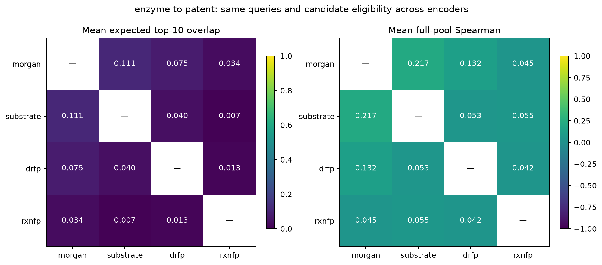

# BioReaction Atlas

[](https://github.com/troicc/bioreaction-atlas/actions/workflows/ci.yml)
[](LICENSE)
[](pyproject.toml)

**How reliably can public reaction corpora provide verifiable abiotic precedents for new-to-nature biocatalysis?**

BioReaction Atlas studies corpus coverage and the dependence of reaction retrieval on representation choice. The current result is a completed encoder-agreement analysis; discovery-event precedent coverage is the next measurement.

[Encoder agreement report](outputs/encoder_consistency/REPORT.md) · [Candidate-pool report](outputs/candidate_pool/REPORT.md) · [Coverage protocol](research/coverage_protocol_v02.md) · [Reproduce](docs/REPRODUCIBILITY.md) · [中文使用说明](README.zh-CN.md)



*Pairwise top-10 agreement and full-pool rank correlation for four reaction representations, over an identical 1,988-candidate patent pool averaged across 639 enzyme queries.*

## Three findings

**1. Which records a researcher sees is largely set by the representation, not the chemistry.** Across six pairs of four representations, mean expected top-10 overlap in enzyme-to-patent retrieval is **0.70%–11.07%** (independent uniform-list reference: 0.503%), with mean full-pool Spearman correlation of 0.042–0.217.

**2. Same-publication candidates inflate apparent agreement.** Within the enzyme corpus, top-10 overlap is 42.82%–62.45%; excluding every candidate that shares a normalized source DOI with the query drops it to **16.64%–37.71%**. Neighbourhoods are substantially composed of the query's own paper, so this exclusion is a necessary control when reporting retrieval quality on enzyme reaction corpora.

| Retrieval setting | Mean expected top-10 overlap across six encoder pairs |
|---|---:|
| Enzyme queries to patent references | 0.70%–11.07% |
| Within the enzyme corpus, self excluded | 42.82%–62.45% |
| Within the enzyme corpus, self and shared publication sources excluded | 16.64%–37.71% |

**3. Structural review of maximum-disagreement cases surfaced provenance defects in the imported public records.** One record's encoded transformation (N–H functionalization) disagrees with its associated publication's subject (intramolecular C(sp3)–H amination); another omits its sulfur-containing substrate from the stored product. Both are flagged, not silently corrected, and require original-SI adjudication before use as discovery labels.

**4. The cross-domain measurement was made in a pool with no correct answer.** For the haem-carbene chemistry that dominates the enzyme seeds, a full scan of all 50,000 Schneider50k rows finds **2 records (0.004%)** carrying a substituted diazo reactant, and neither is a carbene transfer. Across 278 carbene enzyme seeds, **all four representations retrieve zero in-family candidates at top-10**. A literature-derived pool for the same activation family holds 997 carbene reactions of 999 structures from 1,075 papers, where RXNFP's nearest neighbours are aryl diazoacetate N–H insertions at 0.886 cosine — the same transformation the seed performs. Finding 1 measures representation disagreement; it does not establish that a representation failed, because nothing in that pool could have been right. See the [candidate-pool report](outputs/candidate_pool/REPORT.md).

### What these results do not show

Agreement is not accuracy. This analysis does **not** identify the most accurate encoder, establish the absence of small-molecule precedents, or measure discovery-event precedent coverage. Methods, source-macro sensitivity, boundary-tie handling and the full limitations are in the [report](outputs/encoder_consistency/REPORT.md); exact values are in [summary.json](outputs/encoder_consistency/summary.json).

### Measurement choices that the numbers depend on

- **Tie-aware metric.** At top-10 in the patent pool, 43.35% of Morgan-difference and 16.43% of DRFP query lists cross a boundary tie. The primary metric averages over uniform permutations within each tie instead of breaking ties by record ID, so reported agreement does not depend on an arbitrary ordering.
- **Enforced common pool.** Indices are rejected unless they share a corpus hash, a structural view and byte-identical provenance for every common entry; entries align by stable ID, never row position.
- **Sensitivity.** Source-macro reweighting (per-DOI means, then averaged) and 5/6/7-decimal rounding are both reported; rounding moves any pair's mean by at most 0.0042 percentage points.

## Research scope

The main study separates three questions: does an earlier nonenzymatic literature precedent exist, is a corresponding record present in the frozen corpus, and does retrieval find it? The unit is an independently reviewed discovery event, rather than each mutant or substrate record.

The [v0.2 protocol](research/coverage_protocol_v02.md) defines matching, event-specific date cutoffs, search budgets, unresolved cases and overlapping activation/platform strata. The [operating guide](docs/COVERAGE_AUDIT.md) is the per-event loop, and `scripts/coverage_status.py` reports the accounting at any completeness.

The five calibration events are seeded into [`coverage_registry.json`](research/coverage_registry.json) with every state unresolved: **C = 0, U = 5, N = 5**, completion bounds 0.00-1.00, all five structurally unqueryable pending primary-source extraction. It is not a reviewed benchmark, and **no discovery-event candidate coverage rate has yet been measured**. The validator enforces the protocol rather than trusting the annotator: a top-k miss cannot become a corpus absence, corpus presence cannot outrun the literature check, and any resolved decision must name its reviewer.

The [English research proposal](research/research_proposal_EN.md) explains the contribution. Condition reranking and prospective reaction recommendations remain follow-up questions. Map and collection interfaces support the research workflow.

## Run locally

Python 3.11 or newer. For a fresh environment:

```bash
python3 -m venv .venv
.venv/bin/python -m pip install -e '.[test,research,rxnfp]'
```

If the four saved indices are already present:

```bash
PYTHONPATH=src MPLCONFIGDIR=/tmp/ai4c-matplotlib .venv/bin/python scripts/analyze_encoder_consistency.py
.venv/bin/python scripts/write_consistency_report.py
.venv/bin/python -m pytest -q
```

A fresh clone needs the pinned input files and index construction first. Follow [REPRODUCIBILITY.md](docs/REPRODUCIBILITY.md). Missing data must not be replaced with fabricated examples or a different corpus under the same result label.

Outputs cover three retrieval settings, overlap at k = 5/10/20/50, full-pool rank correlations, deterministic and expected tie handling, source-macro means and rounding sensitivity. Figures are PNG/SVG. Full scores, per-query tables and structural cards are generated into ignored `data/local/encoder_consistency/`.

## Data and methods

- Pinned EnzymeEngineeringDB V6: 1,342 rows, 36 DOI sources; [audit](research/data_source_audit.json). This legacy file is not the entire current EnzEngDB service.
- Patent references: 2,000 independently hash-sampled Schneider50k rows, yielding 1,988 unique records; [coverage audit](research/reference_coverage_audit.json).
- Representations: substrate Morgan, signed Morgan difference, official DRFP and official RXNFP bert_ft. Existing configurations and metrics are reused; no new encoder is claimed.
- Boundaries: imported records have not passed original-experiment or earliest-date review. Unique structures are not independent discoveries. Agreement is not accuracy.

The suite contains 134 tests. 133 run in CI on Python 3.11 and 3.12 from the checkout alone; the remaining one verifies RXNFP's 256-dimensional CLS output against the official README example within 1e-5 and needs locally downloaded weights. CI separately regenerates the technical note from `summary.json` and fails if the committed note differs, so no reported metric can be hand-edited. See the report for the evidence chain and limitations.

## Collection and historical ranking tools

- [Chinese walkthrough](docs/从零开始理解与使用BioReaction_Atlas.md)
- [English collection guide](docs/Collection_Guide_EN.md)
- [Building the non-enzymatic candidate pool](docs/BUILDING_THE_CANDIDATE_POOL.md) · [activation-family map](research/activation_family_map.md)
- [Coverage audit operating guide](docs/COVERAGE_AUDIT.md)
- [Single-cutoff historical ranking evaluation](docs/EVALUATION.md)
- [Earlier Chinese overview and local map instructions](README.zh-CN.md)

The two blank collection workbooks are tracked, because `scripts/build_template.mjs` depends on a package that is not public; see the [reproduction gap](docs/REPRODUCIBILITY.md#known-reproduction-gap-collection-workbooks). Generated maps and detailed source-derived outputs remain local products excluded from Git tracking, and their instructions apply after local regeneration. Aggregate agreement results above are included.

## License and project status

Original project code is licensed under [Apache-2.0](LICENSE). See [NOTICE](NOTICE) for scope and [third-party attribution](docs/THIRD_PARTY.md) for upstream methods, data and weights. This license does not relicense third-party datasets or authorize their redistribution. Raw data, weights and detailed derived records remain local by default.

This is a research prototype with a completed descriptive computational result and an unfinished discovery-event audit. No archival DOI or peer-reviewed publication is claimed. Citation metadata will be added with verified author identity and a public release.
